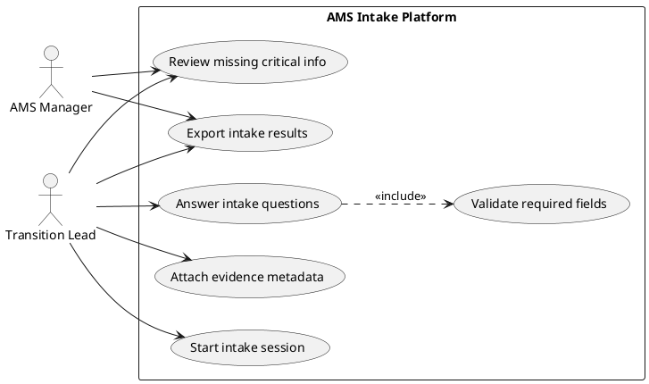

# Lab 5 — Use Case Diagram (Visual Paradigm / PlantUML) + Use Case Syntax

**Input:** `docs/requirements_v1.md` (and your project slice definition)\
**Output:** `docs/use_case_diagram.md`, `docs/use_cases.md` _(plus diagram file/image)_

This lab turns Lesson 5 into practice: you will produce a **Use Case Diagram** and write **Use Case descriptions** using a consistent syntax.

> **GitHub rule:** All deliverables must be committed to your **team GitHub repository** under the exact paths listed below.\
> If it is not in the repo, it is not considered delivered.

---

### <mark style="color:blue;">Objectives</mark>

By the end of Lab 5, your team should be able to:

- Identify actors and define the system boundary correctly
- Create a Use Case Diagram for your selected slice
- Write at least 2 Use Cases using a consistent syntax (main flow + alternatives + exceptions)
- Link Use Cases to your requirements (REQ-###)

---

### <mark style="color:blue;">Tools (logical)</mark>

Use one of the following:

- **Visual Paradigm (Community Edition)** — Use Case Diagram\
  <https://www.visual-paradigm.com/download/community.jsp>

**OR**

- **PlantUML** (alternative) — Use Case Diagram as code\
  (recommended if you want the diagram versioned in Git)

---

### <mark style="color:blue;">Scope (important)</mark>

Your diagram must represent **only the selected slice** (not the entire product).

Examples of slices (adapt to your project):

- Intake Session & Answer Capture
- Evidence Metadata Capture
- Review Missing Critical Info
- Export Results / Generate Report
- RBAC / Permissions Management (if in scope)

---

### <mark style="color:blue;">In-class tasks (step by step)</mark>

#### <mark style="color:$primary;">1) Define the system boundary and actors</mark>

1. Name your system boundary (e.g., “AMS Intake Platform”).
2. Identify **2–4 actors** (roles or external systems).
   - Actors can be people roles (Transition Lead, AMS Manager, Contributor)
   - Actors can be external systems (Identity Provider)
   - Avoid internal components as actors (Database is not an actor).

Write this list in `docs/use_case_diagram.md`.

---

#### <mark style="color:$primary;">2) Draft the Use Case list</mark> <mark style="color:$primary;"></mark><mark style="color:$primary;">**(minimum 6)**</mark>

Create a list of at least **6 use cases** (verb + object).

Examples:

- Start intake session
- Answer intake questions
- Attach evidence metadata
- Review missing critical info
- Validate required fields
- Export intake results

---

#### <mark style="color:$primary;">3) Build the Use Case Diagram (Visual Paradigm or PlantUML)</mark>

Create a diagram that includes:

- system boundary box
- actors
- ≥ 6 use cases
- associations between actors and use cases

Optional relationships (use only if clearly justified):

- `<<include>>` for mandatory reuse
- `<<extend>>` for optional/conditional behavior

**Export/commit diagram**

- If using Visual Paradigm: export as PNG and commit it
- If using PlantUML: commit the `.puml` source (and optionally the rendered image)

---

#### <mark style="color:$primary;">4) Write Use Case descriptions</mark> <mark style="color:$primary;"></mark><mark style="color:$primary;">**(minimum 2)**</mark>

Write **at least 2** use case descriptions in `docs/use_cases.md`.

Each use case must include:

- Primary actor
- Preconditions + Trigger
- Postconditions (success + failure)
- Main flow (happy path)
- At least 1 alternative flow
- At least 1 exception/error case
- Links to requirements (REQ-###)

---

#### <mark style="color:$primary;">5) Link Use Cases to Requirements (REQ-###)</mark>

In each Use Case description:

- Add `Related requirements: REQ-...`

Ensure the mapping makes sense:

- At least 2 REQ items referenced per use case (when possible)
- No “random” linking — it must support traceability

---

### <mark style="color:blue;">Submission / Deliverables</mark>

Commit to your team GitHub repository:

- `docs/use_case_diagram.md`
- `docs/use_cases.md`
- Diagram file:
  - `docs/diagrams/use_case_diagram.png` _(if Visual Paradigm)_\
    **or**
  - `docs/diagrams/use_case_diagram.puml` _(if PlantUML, optionally also a PNG)_

---

### <mark style="color:blue;">Acceptance criteria (delivery)</mark>

Your Lab 5 delivery is accepted when:

- ✅ `docs/use_case_diagram.md` exists and lists:
  - system boundary name
  - actors list
  - use case list (≥ 6)
- ✅ Diagram exists (PNG or PUML) and includes:
  - boundary, actors, ≥ 6 use cases, associations
- ✅ `docs/use_cases.md` contains ≥ 2 complete use case descriptions including:
  - preconditions, trigger, postconditions
  - main flow + at least 1 alternative + at least 1 exception
  - related requirements (REQ-###)
- ✅ All deliverables are committed under the correct paths

---

### <mark style="color:blue;">Templates (copy/paste)</mark>

#### `docs/use_case_diagram.md`

```markdown
# Use Case Diagram — Lab 5

## System boundary

- System name: <...>
- Slice covered: <...>

## Actors (2–4)

- A1: <role/system>
- A2: <role/system>
- A3: <optional>
- A4: <optional>

## Use cases (min. 6)

- UC-01: <verb + object>
- UC-02: <verb + object>
- UC-03: <verb + object>
- UC-04: <verb + object>
- UC-05: <verb + object>
- UC-06: <verb + object>

## Diagram file

- Path: `docs/diagrams/use_case_diagram.png` _(or `.puml`)_
```

#### `docs/use_cases.md`

```markdown
# Use Cases — Lab 5

## UC-01 — <Use Case Name>

- Primary actor: <role>
- Supporting actors: <optional>
- Goal: <what the actor achieves>
- Preconditions: <what must be true before>
- Trigger: <what starts the use case>
- Postconditions (success): <what is true after success>
- Postconditions (failure/cancel): <what is true after failure>
- Related requirements: REQ-..., REQ-...

### Main flow (happy path)

1. Actor ...
2. System ...
3. Actor ...
4. System ...

### Alternative flows

A1. <condition> → ...
A2. <condition> → ...

### Exceptions / errors

E1. <error> → expected system behavior
E2. <error> → expected system behavior

---

## UC-02 — <Use Case Name>

- Primary actor: <role>
- Supporting actors: <optional>
- Goal: ...
- Preconditions: ...
- Trigger: ...
- Postconditions (success): ...
- Postconditions (failure/cancel): ...
- Related requirements: REQ-..., REQ-...

### Main flow (happy path)

1. ...
2. ...

### Alternative flows

A1. ...

### Exceptions / errors

E1. ...
```

---

### <mark style="color:blue;">PlantUML starter (optional)</mark>

If you choose PlantUML, you can start with:


