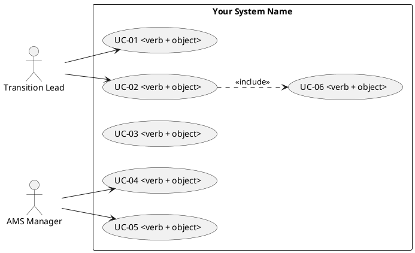

# Lab 6 — Use Case Diagram (Refinement) + Use Case Syntax (Complete) + Traceability

**Input:** Lab 5 outputs (`docs/use_case_diagram.md`, `docs/use_cases.md`, diagram file) + `docs/requirements_v1.md`\
**Output:** `docs/use_case_diagram_v2.md`, `docs/use_cases_v2.md`, `docs/traceability_uc_req.md` _(plus updated diagram file/image)_

This lab continues Lab 5. You will **refine** your Use Case Diagram, write **complete** Use Case descriptions (with alternatives + exceptions), and produce a small traceability view linking Use Cases to Requirements.

> **GitHub rule:** All deliverables must be committed to your **team GitHub repository** under the exact paths listed below.\
> If it is not in the repo, it is not considered delivered.

---

### <mark style="color:blue;">Objectives</mark>

By the end of Lab 6, your team should be able to:

- Improve the Use Case Diagram (scope, actors, naming, relationships)
- Produce at least **2 fully complete** use case descriptions (main flow + alternatives + exceptions)
- Add meaningful `<<include>>` and `<<extend>>` relationships (only where justified)
- Link Use Cases to Requirements (REQ-###) in a traceable way
- Identify missing requirements revealed by Use Case modeling

---

### <mark style="color:blue;">Tools (logical)</mark>

Use one of the following:

- **Visual Paradigm (Community Edition)** — <https://www.visual-paradigm.com/download/community.jsp>
- **PlantUML** (alternative)

---

### <mark style="color:blue;">In-class tasks (step by step)</mark>

#### <mark style="color:$primary;">1) Review and refine the scope (slice)</mark>

1. Confirm your selected slice (same as Lab 5).
2. Ensure the diagram represents only that slice (not the whole product).
3. If the scope is too large, reduce it to what you can describe well.

Write the confirmed scope in `docs/use_case_diagram_v2.md`.

---

#### <mark style="color:$primary;">2) Refine actors and system boundary</mark>

1. Ensure your boundary name is clear and stable (system name).
2. Ensure actors are external roles/systems (not internal components).
3. Update actor names to roles (e.g., “Transition Lead”, “Contributor”, “Identity Provider”).

---

#### <mark style="color:$primary;">3) Refine the Use Case Diagram (v2)</mark>

Update the diagram to include:

- clear system boundary
- 2–4 actors
- ≥ 6 use cases (keep stable naming)
- associations
- **optional relationships**:
  - `<<include>>` only when a behavior is mandatory and reused
  - `<<extend>>` only when the behavior is optional/conditional

<mark style="color:yellow;">**Rules**</mark>

- Do not add include/extend “just because”.
- Keep names as **verb + object**.
- Avoid UI-driven use cases (“click button”, “open screen”).

Commit the updated diagram:

- `docs/diagrams/use_case_diagram_v2.png` _(or `.puml`)_

---

#### <mark style="color:$primary;">4) Upgrade Use Case descriptions (v2)</mark>

Pick **at least 2** use cases and rewrite them as **complete** descriptions.

Each must include:

- Primary actor + goal
- Preconditions + Trigger
- Postconditions (success + failure/cancel)
- Main flow (happy path)
- ≥ 2 alternative flows
- ≥ 2 exceptions/errors
- Related requirements (REQ-###)

**Variant rule**

- At least 1 alternative flow or exception must reflect your variant focus (security, privacy, audit, performance, etc.)

---

#### <mark style="color:$primary;">5) Create UC ↔ REQ traceability</mark>

Create a short traceability view that links:

- Use cases to requirements (REQ-###)

Minimum:

- map all use cases in the diagram (≥ 6) to requirements
- each use case must link to **at least 2 requirements** where reasonable
- identify gaps:
  - “Use case has no requirement”
  - “Requirement is not covered by any use case” (optional check)

---

#### <mark style="color:$primary;">6) Gap log (optional but recommended)</mark>

If Use Cases reveal missing requirements, record them at the bottom of `docs/traceability_uc_req.md` as:

- “Missing requirement candidate: …” Then you can formalize them later.

---

### <mark style="color:blue;">Submission / Deliverables</mark>

Commit to your team GitHub repository:

- `docs/use_case_diagram_v2.md`
- `docs/use_cases_v2.md`
- `docs/traceability_uc_req.md`
- Diagram file:
  - `docs/diagrams/use_case_diagram_v2.png` _(if Visual Paradigm)_\
    **or**
  - `docs/diagrams/use_case_diagram_v2.puml` _(if PlantUML; optionally also PNG)_

---

### <mark style="color:blue;">Acceptance criteria (delivery)</mark>

Your Lab 6 delivery is accepted when:

- ✅ `docs/use_case_diagram_v2.md` states:
  - system boundary name
  - slice covered
  - actors list
  - use case list (≥ 6)
- ✅ Updated diagram exists (PNG or PUML) and shows:
  - boundary, actors, ≥ 6 use cases, associations
  - include/extend used only where justified (optional)
- ✅ `docs/use_cases_v2.md` contains ≥ 2 complete use case descriptions with:
  - main flow + ≥ 2 alternatives + ≥ 2 exceptions
  - preconditions/trigger/postconditions
  - links to REQ-### (meaningful)
  - at least 1 variant-driven alternative/exception
- ✅ `docs/traceability_uc_req.md` maps all use cases to requirements
- ✅ All deliverables are committed under the correct paths

---

### <mark style="color:blue;">Templates (copy/paste)</mark>

#### `docs/use_case_diagram_v2.md`

```markdown
# Use Case Diagram v2 — Lab 6

## System boundary

- System name: <...>
- Slice covered: <...>

## Actors (2–4)

- A1: <role/system>
- A2: <role/system>
- A3: <optional>
- A4: <optional>

## Use cases (min. 6)

- UC-01: <verb + object>
- UC-02: <verb + object>
- UC-03: <verb + object>
- UC-04: <verb + object>
- UC-05: <verb + object>
- UC-06: <verb + object>

## Diagram file

- Path: `docs/diagrams/use_case_diagram_v2.png` _(or `.puml`)_
```

#### `docs/use_cases_v2.md`

```markdown
# Use Cases v2 — Lab 6

## UC-01 — <Use Case Name>

- Primary actor: <role>
- Supporting actors: <optional>
- Goal: <what the actor achieves>
- Preconditions: <what must be true before>
- Trigger: <what starts the use case>
- Postconditions (success): <what is true after success>
- Postconditions (failure/cancel): <what is true after failure>
- Related requirements: REQ-..., REQ-...

### Main flow (happy path)

1. Actor ...
2. System ...
3. Actor ...
4. System ...

### Alternative flows (min. 2)

A1. <condition> → ...
A2. <condition> → ...

### Exceptions / errors (min. 2)

E1. <error> → expected system behavior
E2. <error> → expected system behavior

---

## UC-02 — <Use Case Name>

- Primary actor: <role>
- Supporting actors: <optional>
- Goal: ...
- Preconditions: ...
- Trigger: ...
- Postconditions (success): ...
- Postconditions (failure/cancel): ...
- Related requirements: REQ-..., REQ-...

### Main flow (happy path)

1. ...
2. ...

### Alternative flows (min. 2)

A1. ...
A2. ...

### Exceptions / errors (min. 2)

E1. ...
E2. ...

## Variant-driven notes (required)

- Where did the variant influence a flow or exception?
  - ...
```

#### `docs/traceability_uc_req.md`

```markdown
# Traceability — Use Cases ↔ Requirements (Lab 6)

## Mapping (UC → REQ)

| Use Case | Linked Requirements (REQ-###) | Notes |
| -------- | ----------------------------- | ----- |
| UC-01    | REQ-..., REQ-...              |       |
| UC-02    | REQ-..., REQ-...              |       |
| UC-03    | REQ-..., REQ-...              |       |
| UC-04    | REQ-..., REQ-...              |       |
| UC-05    | REQ-..., REQ-...              |       |
| UC-06    | REQ-..., REQ-...              |       |

## Gaps / Observations (optional)

- Use case without requirements:
- Requirement without use cases:
- Missing requirement candidates revealed by modeling:
  - ...
```

---

### PlantUML starter (optional)


